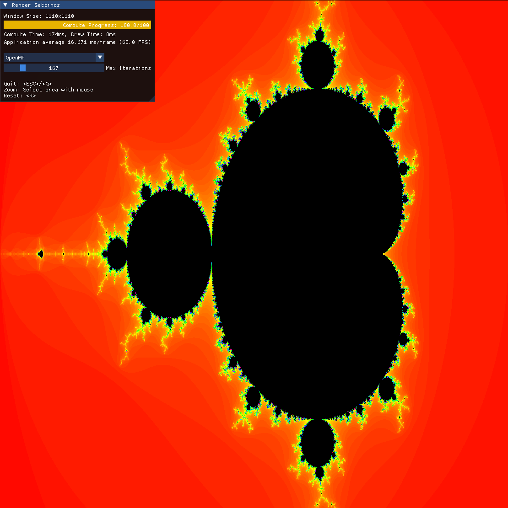

# Mandelbrot Visualizer



## Used Features and Libs?

- ImGUI
- OpenGL
- GLFW
- OpenMP
- C++ Futures
- Docker
- clang-format/tidy
- fmt
- cmake
- pre-commit
<!-- - Cuda -->
- ...?

## Build and Execution

### Docker

build:

```
docker compose build mandelbrot_visualizer
```

run with xorg:

```
xhost +local:docker || true
docker compose run --rm mandelbrot_visualizer
```

### Natively

## Dependencies

- OpenGL
<!-- - Cuda -->
- CMake
- C++11
- OpenMP

_See docker container for Ubuntu/Debian install steps_

#### Build

```
mkdir build -p
cd build
cmake ..
cmake --build .
```

#### Execution

```
export OMP_CANCELLATION=true # enable OpenMP cancellation for redrawing
./mandelbrot_visualizer
```

## Development

- pre-commit
- docker
